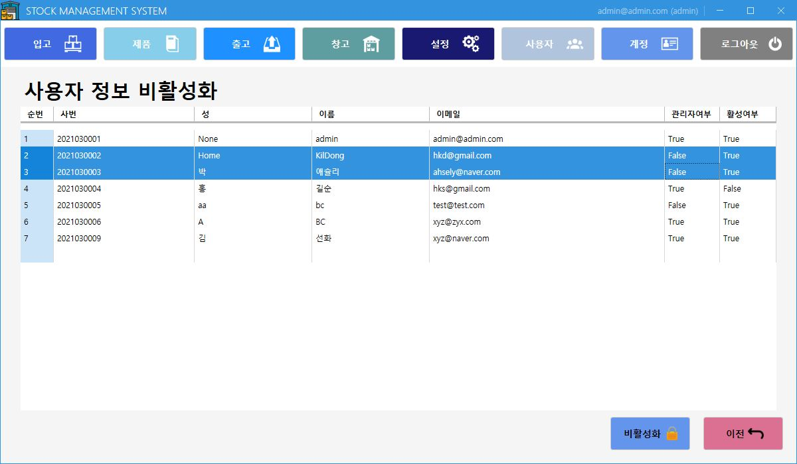

## 📑WpfSMSApp
WPF를 이용한 ERP(전사적 자원 관리) 프로그램입니다.  
(현재진행중..) 

>>  
>>__- 프로그램 시작(로그인) 화면__
>     
>           
>     
>>  
>>__- 계정 정보 화면__
>     
>           
>     
>>  
>>__- 계정 정보 수정__
>     
>           
>     
>>  
>>__- 계정 수정 완료__
>     
>           
>     
>>  
>>__- 전체 사용자 정보__
>     
>           
>     
>>  
>>__- 사용자 정보 입력__
>     
>           
>     
>>  
>>__- 사용자 정보 수정__
>     
>           
>     
>>  
>>__- 사용자 정보 비활성화__
>     
>           
>     
>>  
>>__- 사용자 정보 PDF 변환__
>     
>           
>     
>>  
>>__- 사용자 정보 PDF 변환 결과__
>     
>           
>     
>>  
>>__- 창고 리스트 출력__
>     
>           
>     
>>  
>>__- 창고 정보 입력__
>     
>           
>     
>>  
>>__- 창고 정보 수정__
>     
>           
>     
>>  
>>__- 창고 정보 EXCEL 변환__
>     
>           
>     
>>  
>>__- 창고 정보 EXCEL 변환 결과__
>     
>           
>     

>[(해당 프로젝트)](WpfSMSApp)
